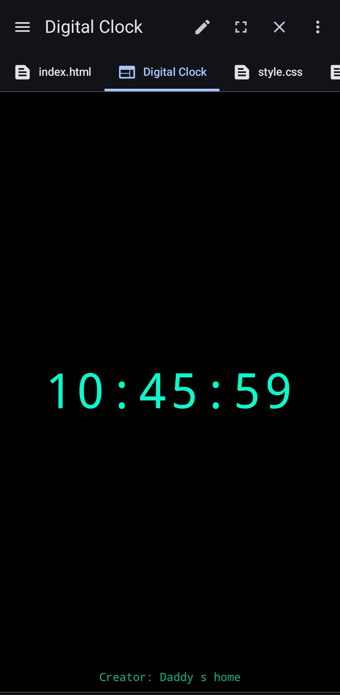

# Digital-Clock
A simple digital clock web app built with HTML, CSS, and JavaScript. It displays the current time in real-time and updates every second using JavaScript’s Date and setInterval functions.

